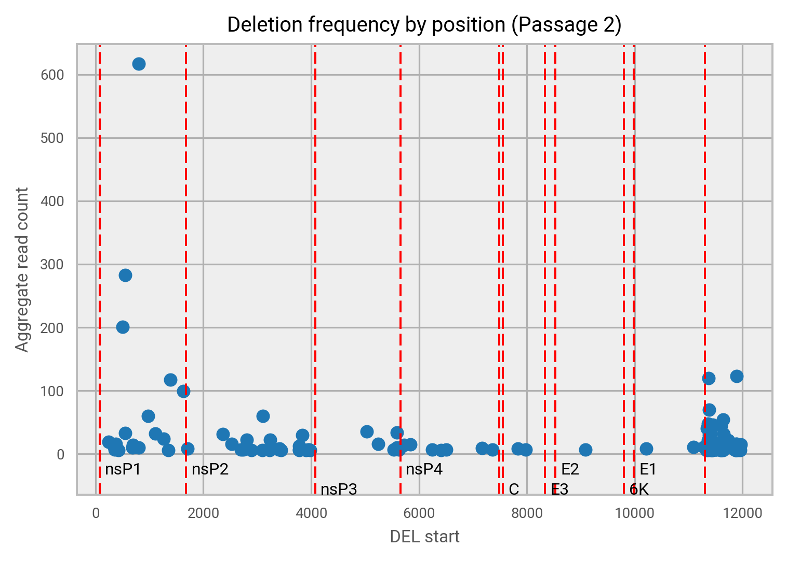
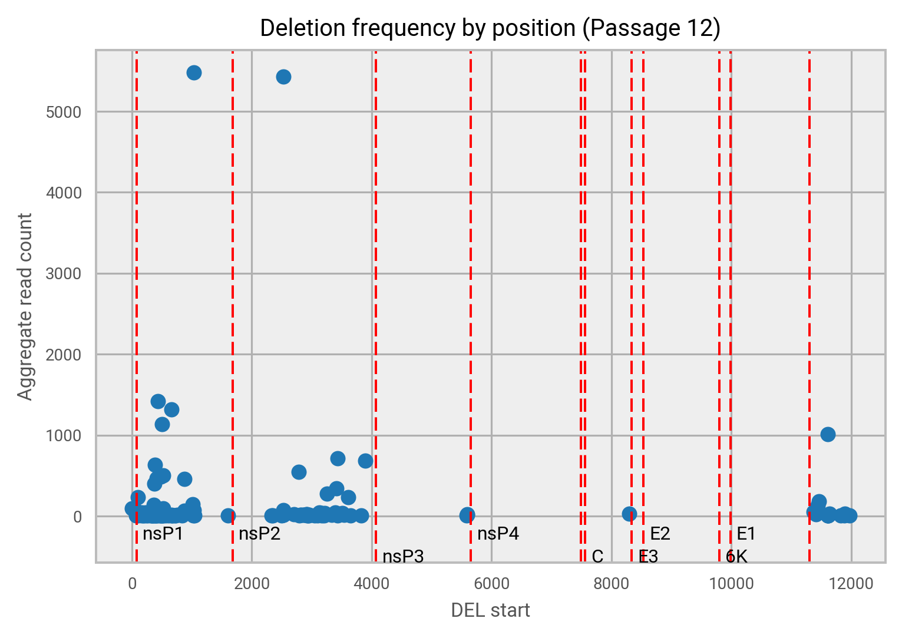
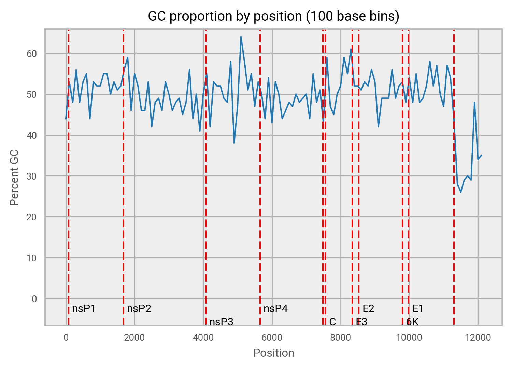
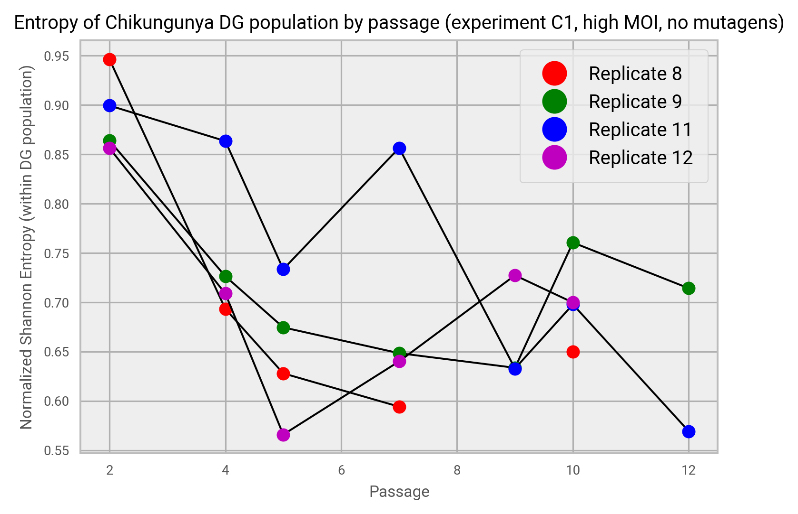

# MISP Camp 2017

This repo contains some of the code developed by Group A during MISP Camp 2017 in Denmark.

## Getting Started with Spark

This project has a few examples of how to use [Apache Spark](https://spark.apache.org/).
It is designed to be used with [Cloudera Data Science Workbench](https://www.cloudera.com/documentation/data-science-workbench/latest/topics/cdsw_overview.html).

See _word_count.py_ and _tips.r_ for examples.

## Data analysis of Chikungunya Defective Genomes

See _del.py_ and _entropy.py_. Also, _norm.sh_ for producing rough normalization read counts.

The following two images show the distribution of deletion start position across the genome. Note that for passage 2 deletions start in all gene regions, while by passage 12 deletions are not found in structural genes.

The following shows the distribution of GC bases across the genome.

Finally, this diagram shows how normalized Shannon entropy varies by passage and replicate. There is a general downward trend to lower entroy states (more ordered), with some oscillation.

